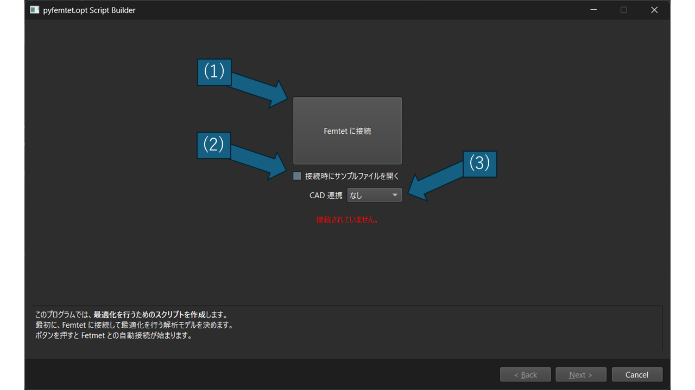
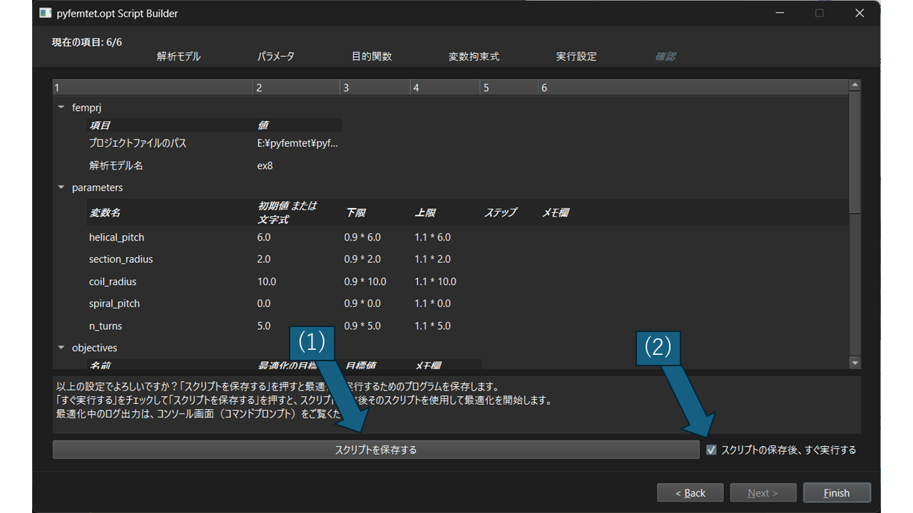

クイックスタート
================

この章では、pyfemtet-opt-gui の基本的な使い方を簡単に説明します。

1. ツールの起動方法
-------------------

自動インストールを行った場合は、デスクトップにショートカットが作成されます。

または、コマンドプロンプトやターミナルで以下のコマンドを実行して起動できます。

.. code-block:: powershell

   py -m pyfemtet_opt_gui

2. サンプルプロジェクトの読み込み
---------------------------------

GUI ツールを開くと、メイン画面が表示されます。

- [1] 「Femtet に接続」ボタン: 起動中の Femtet に接続、未起動なら新規起動して接続します。
- [2] 「接続時にサンプルファイルを開く」チェック: 有効にすると「Femtet に接続」時にサンプルプロジェクトが自動で読み込まれます。
- [3] 「CAD 連携」から「Solidworks」を選択: Solidworks がインストールされていれば、連携して接続します。

    - Solidworks が起動中なら接続、未起動なら新規起動して接続します。
    - [2]「接続時にサンプルファイルを開く」が有効な場合、Solidworks でもサンプルファイルが開かれます。

-----------
3. 動作確認
-----------

- 「Next」を押すと、ウィザード形式の最適化設定画面に進みます。
- すぐに動作確認ができるように、プロジェクトのロード時点でデフォルトの最適化設定が入力されています。
- 各ステップで「Next」を押していくと、最後に「確認」画面が表示されます。

  - [1] 「スクリプトを保存する」を押すと、最適化スクリプトが保存されます。
  - [2] 「スクリプトの保存後、すぐ実行する」にチェックがあると、スクリプト保存後に自動で最適化が実行されます。デフォルトではチェックが入っています。

詳細な使い方は次章以降を参照してください。
